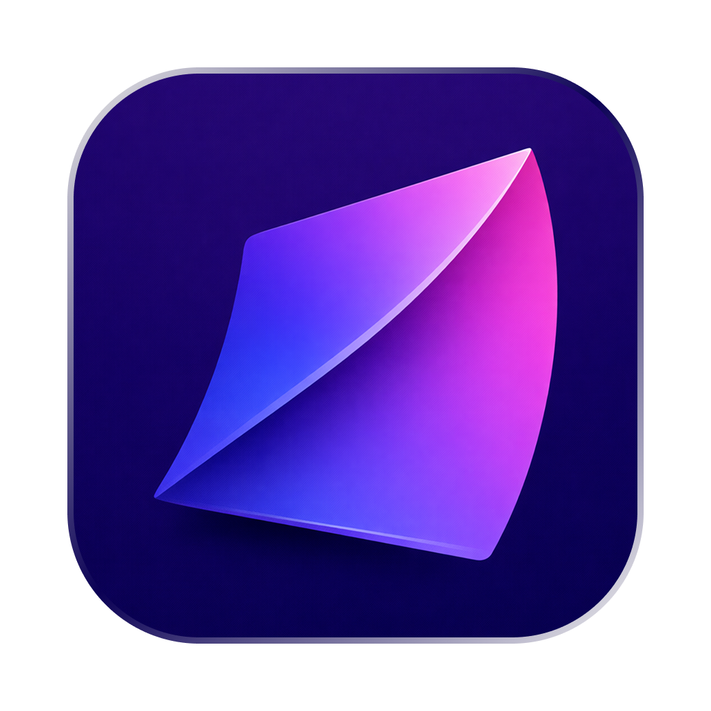
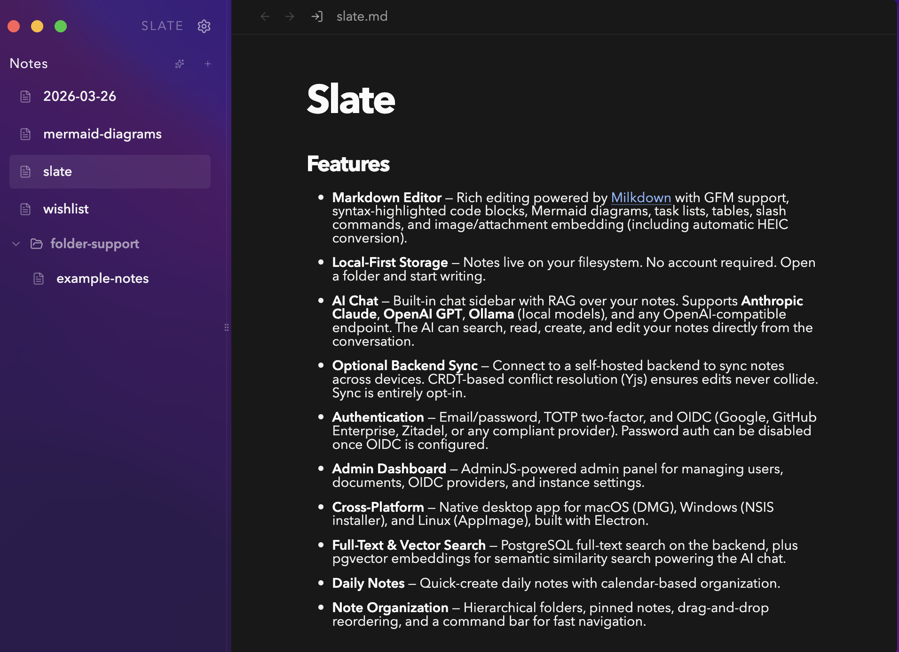
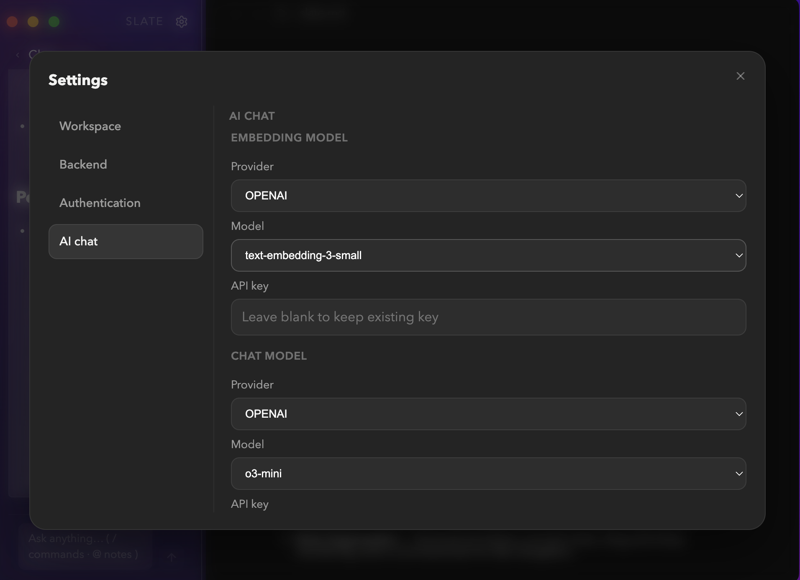
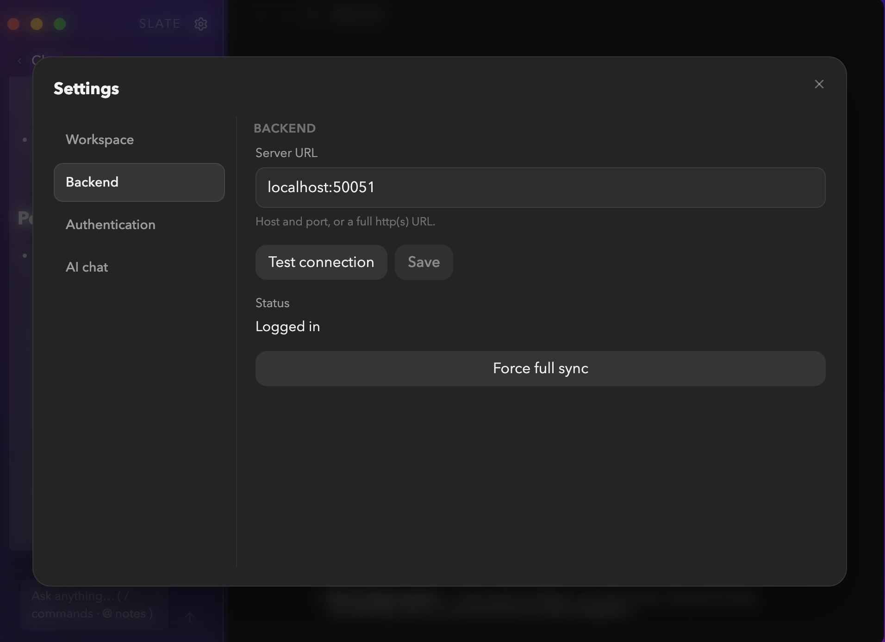
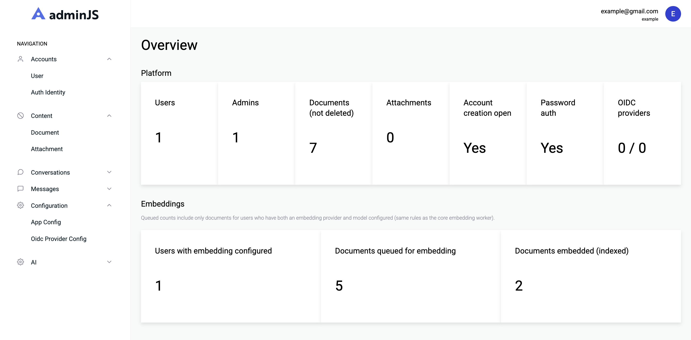

<p align="center">
  
</p>

<h1 align="center">Slate</h1>

<p align="center">
  A local-first Markdown workspace with optional cloud sync, AI-powered chat, and cross-platform desktop support.
</p>

<p align="center">
  <a href="#features">Features</a> &bull;
  <a href="#screenshots">Screenshots</a> &bull;
  <a href="#architecture">Architecture</a> &bull;
  <a href="#getting-started">Getting Started</a> &bull;
  <a href="#deployment">Deployment</a> &bull;
  <a href="#configuration">Configuration</a>
</p>

<p align="center">
  
  
  
</p>

---

## Features

**Markdown Editor** — Rich editing powered by [Milkdown](https://milkdown.dev) with GFM support, syntax-highlighted code blocks, Mermaid diagrams, task lists, tables, slash commands, and image/attachment embedding (including automatic HEIC conversion).

**Local-First Storage** — Notes live on your filesystem. No account required. Open a folder and start writing.

**AI Chat** — Built-in chat sidebar with RAG over your notes. Supports **Anthropic Claude**, **OpenAI GPT**, **Ollama** (local models), and any OpenAI-compatible endpoint. The AI can search, read, create, and edit your notes directly from the conversation.

**Optional Backend Sync** — Connect to a self-hosted backend to sync notes across devices. CRDT-based conflict resolution (Yjs) ensures edits never collide. Sync is entirely opt-in.

**Authentication** — Email/password, TOTP two-factor, and OIDC (Google, GitHub Enterprise, Zitadel, or any compliant provider). Password auth can be disabled once OIDC is configured.

**Admin Dashboard** — AdminJS-powered admin panel for managing users, documents, OIDC providers, and instance settings.

**Cross-Platform** — Native desktop app for macOS (DMG), Windows (NSIS installer), and Linux (AppImage), built with Electron.

**Full-Text & Vector Search** — PostgreSQL full-text search on the backend, plus pgvector embeddings for semantic similarity search powering the AI chat.

**Daily Notes** — Quick-create daily notes with calendar-based organization.

**Note Organization** — Hierarchical folders, pinned notes, drag-and-drop reordering, and a command bar for fast navigation.

---

## Screenshots

<!-- Replace these placeholders with actual screenshots -->

<p align="center">
  
  <br />
  <em>Markdown editor with hierarchical note tree</em>
</p>

<p align="center">
  
  <br />
  <em>AI chat sidebar with RAG over your notes</em>
</p>

<p align="center">
  
  <br />
  <em>Settings — workspace, backend sync, AI providers, and authentication</em>
</p>

<p align="center">
  
  <br />
  <em>Admin dashboard for instance management</em>
</p>

---

## Architecture

Slate is a monorepo with three apps and three shared packages:

```
slate/
├── apps/
│   ├── desktop/           Electron + React + Vite desktop client
│   ├── core-backend/      Fastify REST backend (auth, sync, AI, search)
├── packages/
│   ├── server-db/         Prisma schema & client (shared by both backends)
│   └── shared/            TypeScript types, constants, AI presets
```

### Tech Stack

| Layer     | Technology                                         |
| --------- | -------------------------------------------------- |
| Desktop   | Electron 35, React 19, Vite, TypeScript            |
| Editor    | Milkdown, ProseMirror, Yjs (CRDT)                  |
| Backend   | Fastify 5, REST, JWT, AdminJS                      |
| Database  | PostgreSQL 16 + pgvector                           |
| AI        | LangChain, LangGraph (Anthropic / OpenAI / Ollama) |
| Jobs      | pg-boss (async queue)                              |
| Storage   | Filesystem or S3-compatible (MinIO)                |
| Packaging | Electron Builder, Docker, GitHub Actions           |

---

## Getting Started

### Prerequisites

- **Node.js 22+**
- **npm 10+**
- **Docker** (for PostgreSQL, or bring your own Postgres 16+ with pgvector)

### Quick Start (Desktop Only — No Backend)

```bash
npm install
npm run dev:desktop
```

Choose a local folder as your workspace and start writing. No backend needed.

### Full Stack (Desktop + Backend)

1. **Install dependencies**

   ```bash
   npm install
   ```

2. **Start PostgreSQL**

   ```bash
   make db-up
   ```

3. **Configure environment**

   ```bash
   cp apps/core-backend/.env.example apps/core-backend/.env
   ```

4. **Generate Prisma client & run migrations**

   ```bash
   make db-prisma-generate
   make db-migrate-deploy
   ```

5. **Start services**

   ```bash
   # Terminal 1 — Core backend (REST on :4000)
   make core-dev

   # Terminal 3 — Desktop app
   npm run dev:desktop
   ```

6. **Connect the desktop app** — Open Settings and enter your backend endpoint to enable sync.

### Running Tests

```bash
# Create the test database (one-time)
docker compose exec -T postgres psql -U slate -c 'CREATE DATABASE slate_test;'

# Run core backend integration tests
make core-test

# Run desktop tests
make desktop-test
```

---

## Deployment

### Docker Compose

The included `docker-compose.yml` provides all backend services:

| Service                  | Port        | Description                  |
| ------------------------ | ----------- | ---------------------------- |
| PostgreSQL 16 (pgvector) | 5435        | Database                     |
| Core Backend             | 4000 (REST) | API server                   |
| MinIO                    | 9000, 9001  | S3-compatible object storage |

```bash
# Copy env files
cp apps/core-backend/.env.example apps/core-backend/.env

# Start everything
make db-up
make db-migrate-deploy
make stack-up

# View logs
make stack-logs

# Stop
make stack-down
```

### Desktop Packaging

Build native installers for distribution:

```bash
# Package for current platform
make desktop-package

# Or build + package
make desktop-build
make desktop-package
```

Produces:

- **macOS**: `.dmg` and `.zip`
- **Windows**: NSIS installer
- **Linux**: AppImage

### CI/CD

GitHub Actions workflows handle:

- **CI** — Backend integration tests (against real Postgres), desktop linting and builds on every push
- **Release** — Automatic semantic versioning, Docker images published to GHCR, desktop installers uploaded as GitHub Release assets

---

## Configuration

### AI Setup

Slate supports multiple AI providers, configurable per-user in Settings:

| Provider           | Chat | Embeddings | Notes                    |
| ------------------ | ---- | ---------- | ------------------------ |
| Anthropic (Claude) | Yes  | —          | Requires API key         |
| OpenAI             | Yes  | Yes        | Requires API key         |
| Ollama             | Yes  | Yes        | Local, no API key needed |
| OpenAI-compatible  | Yes  | Yes        | Any compatible endpoint  |

Vector embeddings power semantic search in the AI chat. After configuring an embedding provider, trigger indexing from the AI settings panel.

### OIDC Setup

Register these redirect URIs with your identity provider:

| Callback      | URI                                                     |
| ------------- | ------------------------------------------------------- |
| Admin login   | `https://<core-backend-host>/admin/login/oidc/callback` |
| Desktop login | `http://127.0.0.1:<port>/oidc/callback`                 |

Required scopes: `openid profile email`

Manage OIDC providers through the admin API:

```
POST   /internal/admin/oidc/providers          # Create provider
PATCH  /internal/admin/oidc/providers/:id       # Update provider
DELETE /internal/admin/oidc/providers/:id       # Delete provider
PATCH  /internal/admin/settings/password-auth-enabled  # Toggle password auth
```

> Password auth can only be disabled when at least one OIDC provider is enabled and at least one admin has logged in via OIDC.

### Environment Variables

See the `.env.example` files in each backend app for all available options:

- `apps/core-backend/.env.example`

---

## Make Commands

| Command                             | Description                    |
| ----------------------------------- | ------------------------------ |
| `make install`                      | Install all dependencies       |
| `make desktop-up`                   | Start desktop app in dev mode  |
| `make core-dev`                     | Start core backend in dev mode |
| `make db-up` / `make db-down`       | Start / stop PostgreSQL        |
| `make db-prisma-generate`           | Generate Prisma client         |
| `make db-migrate-deploy`            | Apply database migrations      |
| `make db-migrate-dev NAME=...`      | Create a new migration         |
| `make core-test`                    | Run core backend tests         |
| `make desktop-test`                 | Run desktop tests              |
| `make desktop-build`                | Build desktop app              |
| `make desktop-package`              | Package desktop installers     |
| `make stack-up` / `make stack-down` | Start / stop Docker stack      |
| `make stack-logs`                   | Tail backend service logs      |

---

## Contributing

1. Fork the repository
2. Create a feature branch
3. Make your changes
4. Run tests with `make core-test`
5. Open a pull request

---

<p align="center">
  Built with Electron, React, Fastify, and PostgreSQL
</p>
